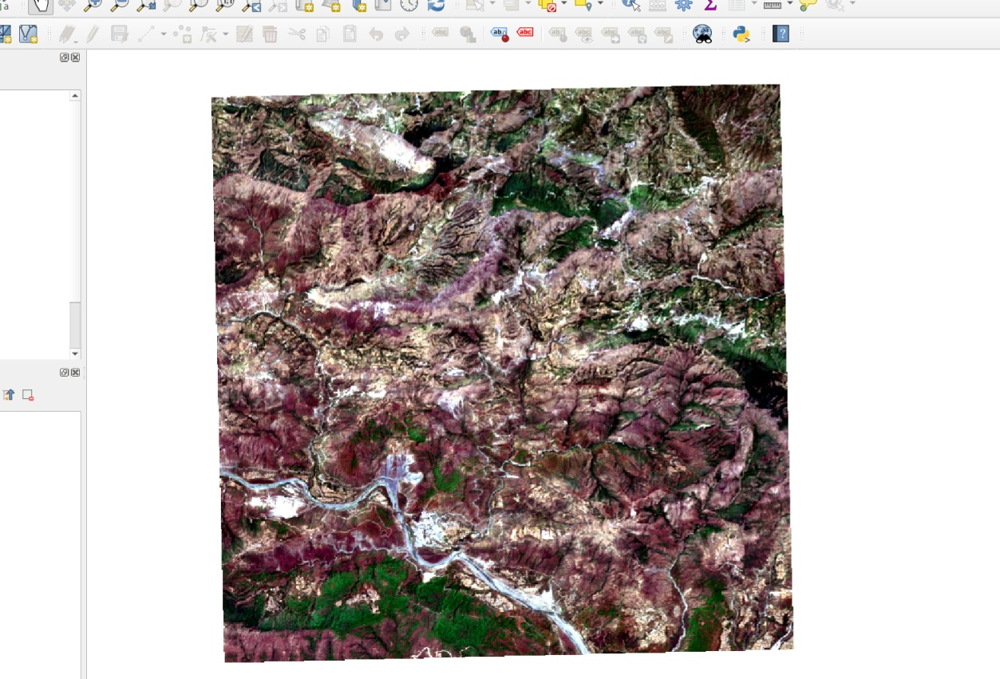
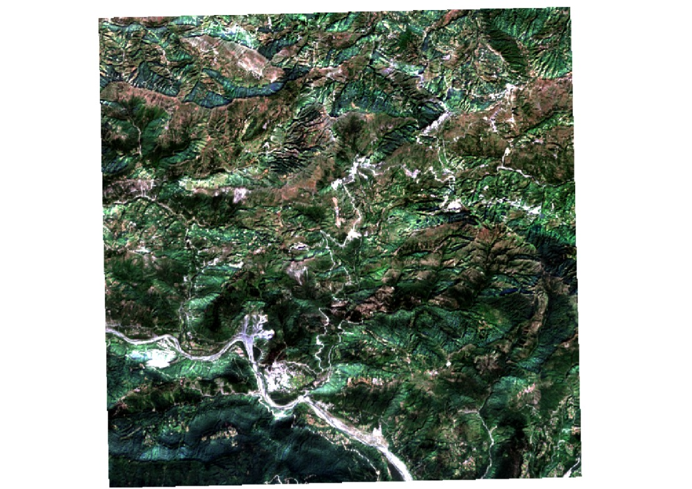
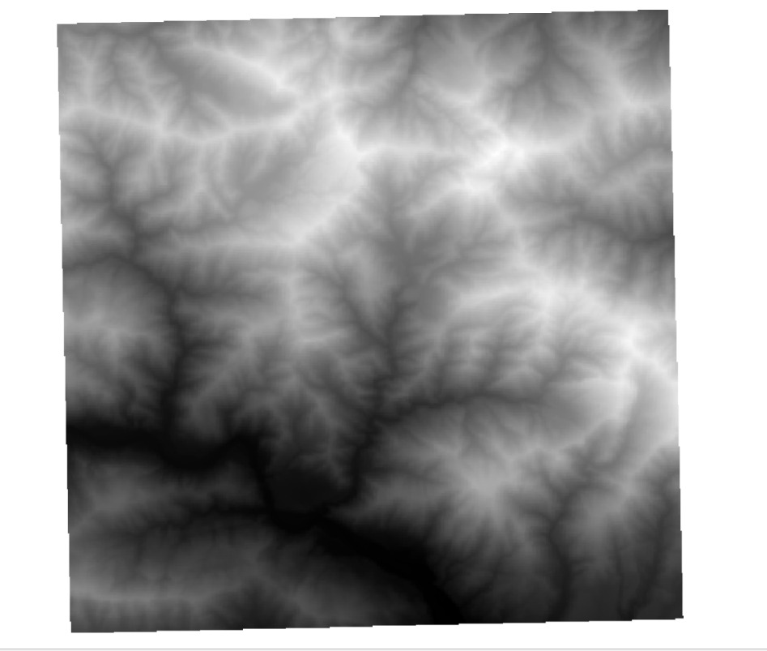

# Himalayan Landslide Detection Pipeline

**Satellite-based change detection for preliminary landslide assessment in the Himalayas.**

The Himalayan Landslide Detection Pipeline is a proposed geospatial system that analyses satellite imagery and terrain information to identify areas showing potential landslide-related surface changes. It aims to combine spectral indicators, terrain context and semantic image features to generate interpretable, geographically referenced candidate alerts.

> **Project status:** Research prototype under development. The complete pipeline is proposed architecture, not a claim that every component is implemented or validated.

---

## Q1. What is this project?

It is a satellite-based geospatial change-detection system designed to identify landscape changes that may be associated with landslides.

The initial approach uses Sentinel-2 optical imagery, elevation data and multiple change indicators. The intended output is a map of candidate regions that can be inspected by researchers or disaster-assessment teams.

## Q2. What problem does it address?

Landslide assessment in the Himalayas is challenging because of steep terrain, difficult ground access, changing weather and the large areas that may require investigation.

Satellite imagery provides a way to compare landscape conditions across different dates. However, vegetation changes, snowmelt, cloud shadows and other environmental variations can produce misleading signals.

This project investigates how multiple sources of evidence can be combined to identify potentially relevant changes for further assessment.

## Q3. What is the proposed solution?

The system follows an eight-stage pipeline:

1. Define the Area of Interest (AOI) and reference event.
2. Acquire suitable pre-event and post-event Sentinel-2 imagery.
3. Process elevation data and derive terrain features such as slope.
4. Analyse NDVI and NDSI changes.
5. Explore semantic image features using TerraMind.
6. Combine the selected signals through an interpretable scoring method.
7. Generate geographically referenced candidate regions.
8. Present the results through a planned map-based interface.

See the [System Architecture](project-documentation/SYSTEM_ARCHITECTURE.md) for the complete pipeline.

## Q4. What satellite and terrain data does it use?

The proposed workflow uses:

- **Sentinel-2 optical imagery:** Multispectral observations for comparing surface conditions.
- **Digital Elevation Model (DEM):** Elevation data used to derive terrain characteristics such as slope.
- **Sentinel-1 SAR:** A potential future extension to investigate complementary radar observations.

The initial approach focuses on optical imagery. Radar integration is a later extension and is not assumed to be implemented.

### Satellite and terrain data

The following images illustrate the data used in the project.

| T1 — Earlier observation | T2 — Later observation |
|---|---|
|  |  |

**DEM — Elevation and terrain context**

*Note: T1 and T2 refer to the earlier and later observations used for comparison. Their exact acquisition dates, seasonal periods and relationship to a documented landslide event must be established from the source metadata before interpreting them as pre-event and post-event evidence.*

## Q5. How will the system identify changes?

The proposed methodology combines three types of evidence:

- **Spectral indicators:** NDVI and NDSI changes to investigate vegetation-related and snow-related variations.
- **Terrain context:** Elevation and slope to assess the geographical plausibility of candidate regions.
- **Semantic features:** TerraMind-derived representations to explore additional landscape changes.

An evidence-fusion stage will combine selected signals into candidate scores. The scoring rules and thresholds must be evaluated against suitable reference data.

A detected change is not automatically a landslide.

## Q6. What makes the approach different?

The proposed contribution is the combination of multiple evidence sources in an interpretable workflow.

Instead of relying exclusively on a single spectral index, the system is designed to investigate how spectral changes, terrain context and semantic features can complement one another.

The scoring approach is intended to expose the signals contributing to a candidate alert, making results easier to inspect and validate.

The effectiveness of this approach remains to be demonstrated through testing and comparison with suitable baselines.

## Q7. What will the output look like?

The intended output is a geospatial map containing candidate regions, with supporting information such as:

- Geographic location of each candidate.
- Candidate assessment score.
- Contributing change indicators.
- Relevant source imagery and observation dates.
- Data-quality limitations and uncertainty.

The proposed interface will help users inspect the evidence behind a candidate rather than treating an automated score as a confirmed finding.

## Q8. What is the current implementation status?

The project is under development. The complete eight-stage pipeline represents the intended system design.

The implementation status of each component will be updated as code and outputs are verified. Detection accuracy, alert reliability and the effectiveness of semantic features have not been established merely by defining the architecture.

The initial development priority is to establish a reproducible imagery-acquisition and comparison workflow before expanding the system.

## Q9. How will the system be evaluated?

The proposed evaluation will use suitable reference data and documented test cases.

Planned evaluation measures include:

- **Precision:** How many detected candidates correspond to reference landslides.
- **Recall:** How many reference landslides are identified.
- **F1-score:** A combined measure of precision and recall.
- **Spatial overlap:** Agreement between candidate regions and reference landslide boundaries.
- **False-positive analysis:** Investigation of detections caused by snow, vegetation, clouds, shadows or other unrelated changes.

Metrics will be reported after implementation and testing. No accuracy claim should be made without supporting results.

## Q10. What are the main limitations?

- Optical imagery may be affected by cloud cover and cloud shadows.
- Seasonal vegetation and snow changes can resemble landslide-related changes.
- Terrain resolution may limit the detection of small events.
- Inconsistent observation dates or image quality can distort comparisons.
- Semantic features may not generalise reliably to the Himalayan environment.
- Incomplete reference data can make evaluation unreliable.

The system is intended for preliminary assessment and does not replace field verification or official disaster-management decisions.

## Q11. What is the intended impact?

If successfully implemented and validated, the system could help researchers and disaster-assessment teams prioritise areas for further investigation, inspect landscape changes over large regions and document the evidence supporting candidate detections.

Its practical value will depend on data quality, validation results and the reliability of the complete workflow.

## Q12. Where can judges find more information?

- [Project Documentation](project-documentation/PROJECT_DOCUMENTATION.md) — problem statement, proposed solution, novelty, feasibility and expected impact.
- [System Architecture](project-documentation/SYSTEM_ARCHITECTURE.md) — pipeline diagram, components, data flow and expected outputs.
- [Methodology and Evaluation](project-documentation/METHODOLOGY_AND_EVALUATION.md) — detailed processing methodology, validation plan and limitations.

## Data Sources and Technical Resources

- [Copernicus Sentinel-2](https://dataspace.copernicus.eu/explore-data/data-collections/sentinel-data/sentinel-2)
- [Copernicus Data Space Ecosystem](https://dataspace.copernicus.eu/)
- [Google Earth Engine Documentation](https://developers.google.com/earth-engine)
- [TerraMind — Official GitHub Repository](https://github.com/IBM/terramind)

---

**Disclaimer:** This project is a research prototype for satellite-based change analysis. Candidate detections and scores are not confirmed landslides or calibrated probabilities unless independently validated.
