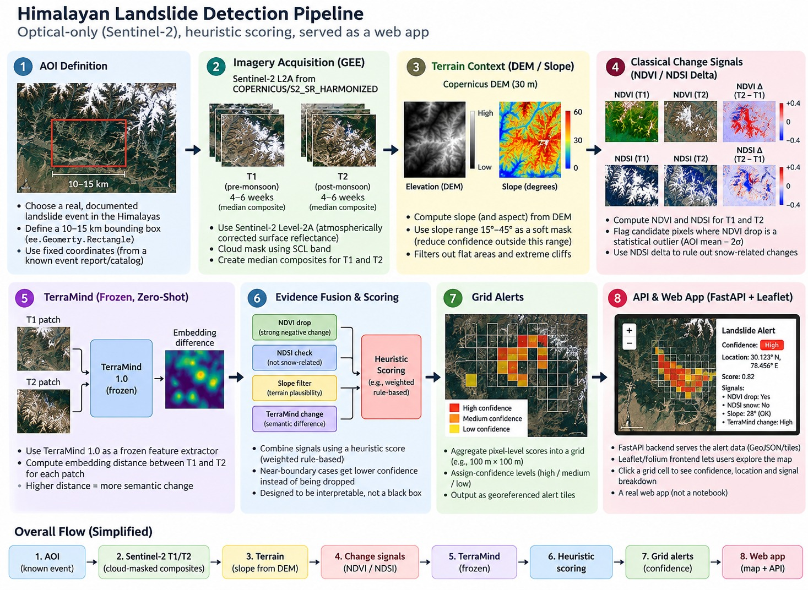

# System Architecture — Himalayan Landslide Detection Pipeline

## 1. System Overview

The Himalayan Landslide Detection Pipeline is a proposed geospatial system designed to identify potential landslide-related surface changes using satellite imagery and terrain information.

It combines Sentinel-2 optical imagery, terrain analysis, spectral change indicators and proposed semantic features to assess candidate regions. The intended output is a georeferenced map of potential landslide areas, supported by interpretable evidence.

The architecture consists of eight stages, from selecting a study area to visualising candidate alerts. The complete pipeline represents the proposed design; implementation and validation are ongoing.

## 2. Proposed System Architecture

*Figure 1: Proposed end-to-end architecture of the Himalayan Landslide Detection Pipeline.*

## 3. Pipeline at a Glance

| Stage | Component | Purpose |
|---|---|---|
| 1 | Area of Interest (AOI) | Define the study area and reference landslide event. |
| 2 | Sentinel-2 Imagery | Acquire pre-event and post-event satellite imagery. |
| 3 | Terrain Analysis | Use elevation data to derive slope and terrain context. |
| 4 | Spectral Change Detection | Analyse NDVI and NDSI changes to investigate vegetation and snow-related variations. |
| 5 | TerraMind Features | Explore semantic image features to identify additional landscape changes. |
| 6 | Evidence Fusion | Combine spectral, terrain and semantic signals using a proposed scoring method. |
| 7 | Geospatial Alerts | Organise candidate scores into geographically referenced grid cells. |
| 8 | Web Application | Display candidate locations and supporting evidence on an interactive map. |

## 4. Inputs and Expected Outputs

**Inputs**
- Geographical study-area boundary and event dates.
- Pre-event and post-event Sentinel-2 imagery.
- Digital Elevation Model (DEM) and derived terrain features.

**Expected outputs**
- Spectral and terrain change layers.
- Candidate landslide scores with supporting evidence.
- Georeferenced candidate regions for map-based inspection.

These outputs are intended to support preliminary assessment, not independently confirm a landslide.

## 5. Key Design Principle

The proposed system combines multiple sources of evidence rather than relying on a single change indicator. Terrain context and snow-related checks may help interpret spectral changes, while semantic features provide an additional signal to investigate.

Optical imagery can be affected by clouds, shadows, snow and seasonal vegetation changes. Candidate detections therefore require validation against suitable reference data and, where possible, independent observations.

## 6. Implementation Status

This diagram represents the proposed end-to-end architecture. Individual stages will be labelled as implemented only after the corresponding code and outputs have been verified. Detection performance and alert reliability remain subject to evaluation.
